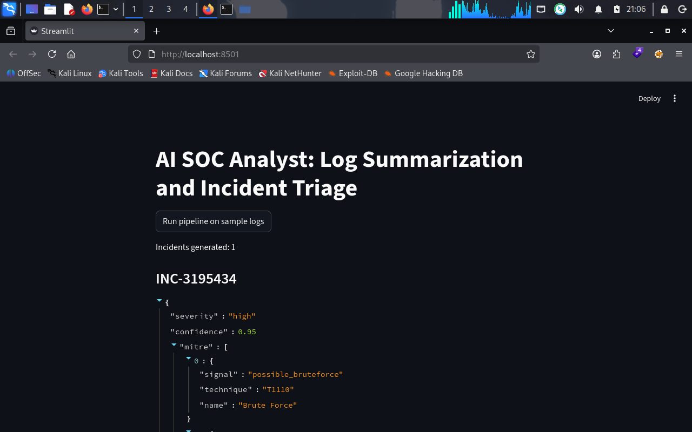
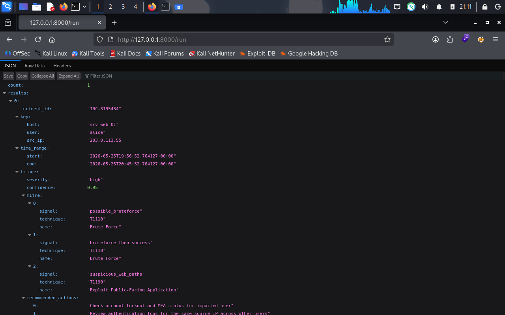

# AI SOC Analyst: Log Summarization and Incident Triage

An automated, defensive cyber security workflow that ingests, normalizes, correlates, and triages multi-source raw infrastructure log streams to extract meaningful alerts, map payloads to the MITRE ATT&CK framework, and output forensic case evidence.

---

## Architecture Flow & Strategy

```text
  ┌──────────────────────────────────────────────────────────────────────────┐
  │                           Raw Security Logs                              │
  │                 (Authentication, Web Streams, Firewall)                  │
  └────────────────────────────────────┬─────────────────────────────────────┘
                                       │
                                       ▼
  ┌──────────────────────────────────────────────────────────────────────────┐
  │                            Normalization                                 │
  │     ──► Standardizes disparate streams to Canonical Common JSON Schema   │
  └────────────────────────────────────┬─────────────────────────────────────┘
                                       │
                                       ▼
  ┌──────────────────────────────────────────────────────────────────────────┐
  │                             Correlation                                  │
  │     ──► Rule-based Time-Windowed Tracking (Sliding Window Strategy)      │
  └────────────────────────────────────┬─────────────────────────────────────┘
                                       │
                                       ▼
  ┌──────────────────────────────────────────────────────────────────────────┐
  │                            Triage Matrix                                 │
  │     ──► MITRE ATT&CK Tagging & Algorithmic Severity/Confidence Calculators│
  └────────────────────────────────────┬─────────────────────────────────────┘
                                       │
                                       ▼
  ┌──────────────────────────────────────────────────────────────────────────┐
  │                         Case File Generation                             │
  │     ──► Dual Export Assets: Automated Forensic Logs (.json + .md)        │
  └────────────────────────────────────┬─────────────────────────────────────┘
                                       │
                                       ▼
  ┌──────────────────────────────────────────────────────────────────────────┐
  │                          Presentation Layer                              │
  │     ──► Distributed API Gateway (FastAPI) & Operator UI (Streamlit)      │
  └──────────────────────────────────────────────────────────────────────────┘

```
### 1. Ingestion & Normalization
Disparate infrastructure components record telemetry using completely independent semantics (`message`, `path`, status codes). The parser processes those components into a **Canonical Common Schema** (`docs/schemas/normalized_event.json`), ensuring down-stream data parsing features can rely on predictable typing and keys regardless of source log origins.

### 2. Behavioral Correlation Strategy
Rather than generating single atomic alerts (which causes severe analyst fatigue), the engine tracks state combinations using sliding interaction keys: `(host, user, src_ip)`. 
Events are aggregated into complex operational incidents when logical rule sequences cross multi-signal correlation barriers:
* **Possible Brute Force:** $\ge 10$ unique authentication failure events.
* **Brute Force with Lateral Success:** Authentication failure threshold immediately followed by an explicit authentication success signature from the same identifier key.
* **Exploitation/Web Scanning:** Inbound traffic containing structural queries targeting known web assets (`/.env`, `/backup.zip`).

---

## Triage Scoring Engine & MITRE Mapping

Incidents are mapped to standard MITRE ATT&CK Framework elements:
* **T1110 (Brute Force)**
* **T1190 (Exploit Public-Facing Application)**

### Algorithmic Triage Calculations
The component assigns logical vector weights to calculated conditions:
* **Base Calculation:** $$\text{Severity Score} = \sum \text{Severity Weight of Captured Signals}$$

* **Classification Range:** High ($\ge 6$), Medium ($\ge 3$), Low ($< 3$).
* **Confidence Engine Matrix:** $$\text{Confidence} = \min(0.95, 0.50 + (0.10 \times \text{Severity Score}))$$

---

## Setup & Execution

### Prerequisites
* Python 3.10 to 3.13 installed.

### Installation
```
# 1. Clone & Navigate to Repository Root
cd ai-soc-triage-assistant
```
# 2. Instantiate and Activate Virtual Environment
```
python -m venv .venv
source .venv/bin/activate  # On Windows use: .venv\Scripts\activate
```
# 3. Upgrade Pip and Install Dependencies
```
pip install -U pip
pip install -r requirements.txt
Execution Lifecycles
Run the full operational execution pipeline linearly via the command line:
```
# Generate synthetic dataset log tracks
```
python src/data/generate_sample_logs.py
```
# Standardize data to the schema target
```
python src/parsing/normalize.py
```
# Correlate tracks into behavioral events
```
python src/correlation/correlate.py
```
Accessing the Interfaces
1. Operator Management UI Console (Streamlit)
To ensure absolute paths resolve correctly from your workspace environment, start the Streamlit service with the explicit execution path mapping flag:

```
PYTHONPATH=. streamlit run src/ui/app.py
```
2. FastAPI Engine Integration
To launch the backend API engine interface layer:

```
PYTHONPATH=. uvicorn src.api.app:app --reload --port 8000
```
Trigger processing via HTTP Request: curl "http://127.0.0.1:8000/run"

Example Case File Output
Below is an excerpt from a generated markdown case file (docs/cases/INC-3195434.md):


# Incident Case File: INC-3195434

## 1. Automated Analysis Summary
Incident INC-3195434 detected for host=srv-web-01 user=alice src_ip=203.0.113.55.
Time window: 2026-05-26T19:56:52Z to 2026-05-26T20:45:52Z.
Severity: HIGH (Confidence: 0.95).

Signals observed:
- possible_bruteforce (count=30)
- bruteforce_then_success (count=1)
- suspicious_web_paths (count=4)

Mapped MITRE ATT&CK Techniques:
- T1110 Brute Force (triggered via possible_bruteforce)
- T1190 Exploit Public-Facing Application (triggered via suspicious_web_paths)

Recommended Next Actions:
- Check account lockout and MFA status for impacted user
- Review authentication logs for the same source IP across other users
- Block or rate-limit suspicious source IP at the edge
- Inspect web server for suspicious requests and recent configuration changes
Advanced Feature Configuration: LLM Summarization
To substitute the deterministic analyzer with an AI-driven security analysis:

Populate .env with valid credentials:

Code snippet
LLM_PROVIDER=openai
LLM_API_KEY=your-high-entropy-api-token-value
LLM_MODEL=gpt-4o-mini
Un-comment the OpenAI implementation model provided inside src/llm/client.py.

The platform will automatically pivot to the advanced cognitive processing pipeline, using structural prompt frames to generate contextual summaries without altering downstream tracking formats.

Ethics and Privacy Matrix
Synthetic Telemetry Execution Strategy: All data records within this tracking repository are synthetically generated using structural patterns. No corporate internal logs or customer indicators are exposed.

Production Sanitization Notice: Production deployments must use a pre-processing scrubbing pipeline to mask sensitive PII (Personally Identifiable Information) before log evaluation pipelines process data packets.
